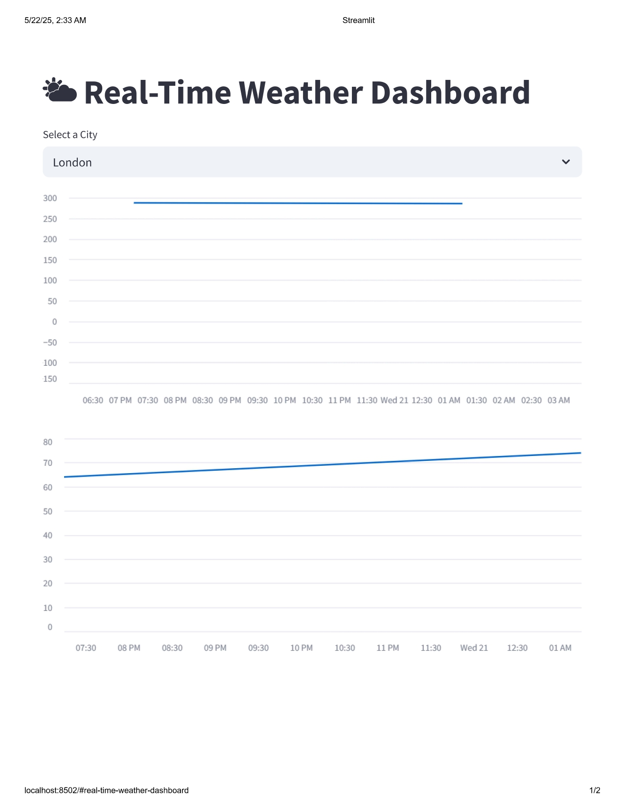
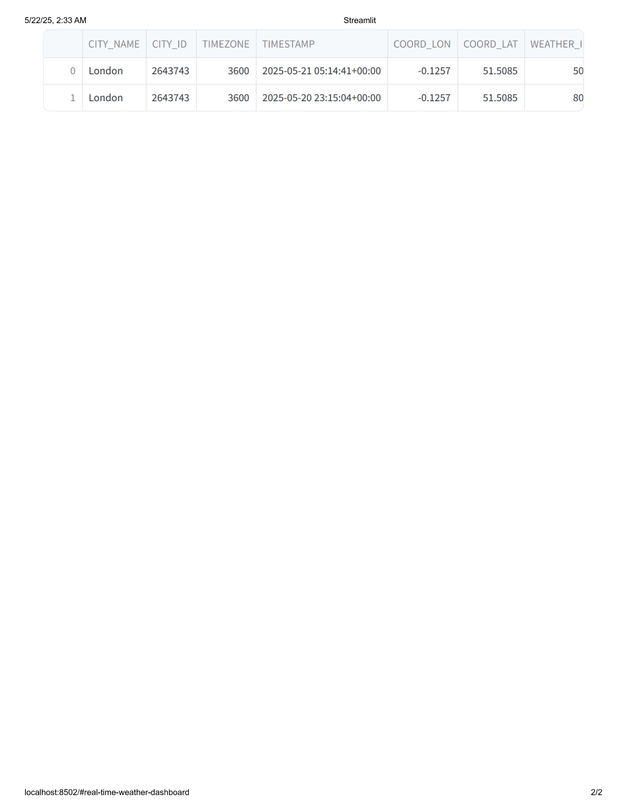

<h1 align="center">🌦️ Real-Time Weather Data Pipeline</h1>

<p align="center">
  
  
  
  
  
</p>

<p align="center">
  A production-style end-to-end cloud data pipeline that ingests real-time weather data from the OpenWeatherMap API, stores it in AWS S3, loads it into Snowflake via Snowpipe, and visualizes it on an interactive Streamlit dashboard.
</p>

---

## 🏗️ Architecture

```
OpenWeatherMap API
        │
        ▼
  Python Script (weathermain.py)
        │
        ▼
   AWS S3 Bucket (raw JSON)
        │
        ▼
  Snowpipe (auto-ingest)
        │
        ▼
  Snowflake Data Warehouse
        │
        ▼
  Streamlit Dashboard (weatherapp.py)
```

---

## ✨ Features

- 🌐 **Live weather ingestion** — fetches temperature, humidity, wind speed & conditions from OpenWeatherMap API
- ☁️ **AWS S3 storage** — raw JSON payloads stored in S3 with timestamped file naming
- ❄️ **Snowpipe auto-ingest** — automated, event-driven data loading into Snowflake tables
- 📊 **Interactive dashboard** — real-time charts for temperature and humidity trends via Streamlit
- 🔐 **Secure config** — all credentials managed via `.env` (never committed to version control)

---

## 🛠️ Tech Stack

| Layer | Technology |
|-------|-----------|
| Data Ingestion | Python, OpenWeatherMap API |
| Cloud Storage | AWS S3 |
| Data Warehouse | Snowflake + Snowpipe |
| Visualization | Streamlit |
| Config Management | python-dotenv |

---

## 📸 Dashboard Screenshots




---

## 🚀 Getting Started

### Prerequisites

- Python 3.10+
- AWS account with S3 bucket configured
- Snowflake account with Snowpipe set up
- OpenWeatherMap API key (free tier works)

### Installation

1. **Clone the repository**

```bash
git clone https://github.com/AMIREDDYSHIVANI/weather-pipeline-snowflake.git
cd weather-pipeline-snowflake
```

2. **Install dependencies**

```bash
pip install -r requirements.txt
```

3. **Configure environment variables**

```bash
cp .env.example .env
```

Edit `.env` with your credentials:

```env
OWM_API_KEY=your_openweather_api_key
AWS_ACCESS_KEY=your_aws_access_key
AWS_SECRET_KEY=your_aws_secret_key
AWS_BUCKET_NAME=your_s3_bucket_name
SNOWFLAKE_ACCOUNT=your_snowflake_account
SNOWFLAKE_USER=your_username
SNOWFLAKE_PASSWORD=your_password
```

---

## ▶️ Usage

**Run the data ingestion pipeline:**

```bash
python weathermain.py
```

**Launch the Streamlit dashboard:**

```bash
streamlit run weatherapp.py
```

---

## 🗺️ Roadmap

- [x] OpenWeatherMap API ingestion
- [x] AWS S3 raw storage
- [x] Snowflake ingestion via Snowpipe
- [x] Streamlit visualization dashboard
- [ ] Power BI integration
- [ ] Multi-city support
- [ ] Automated scheduling with Apache Airflow

---

## 🤝 Contributing

Contributions are welcome!

1. Fork the repository
2. Create a feature branch: `git checkout -b feature/YourFeature`
3. Commit your changes: `git commit -m 'Add YourFeature'`
4. Push to branch: `git push origin feature/YourFeature`
5. Open a Pull Request

---

## 📄 License

Distributed under the MIT License. See `LICENSE` for details.

---

## 👩‍💻 Author

**Shivani Amireddy**

[](https://www.linkedin.com/in/shivani-reddy-458600400)
[](https://github.com/AMIREDDYSHIVANI)
